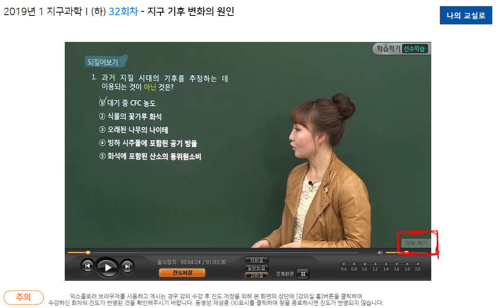

# 온라인수업 자막 오프너

[온라인수업](https://hs.onlineschool.or.kr/main.do) 강좌를 소리없이 듣고싶다고요? 그런 여러분들을 위해 준비했습니다! **온라인수업 자막 오프너**!!

## 소개

온라인수업 강좌에는 내부적으로 자막이 포함되어 있을 뿐, 이를 활성화하는 방법을 제공하지 않고 있습니다. **온라인수업 자막 오프너**는 숨겨져 있던 자막을 활성화하는 기능을 제공합니다.

## 사용법

온라인수업 사이트에 접속하여 강의 영상을 재생하신 후 영상 우측 하단의 '자막 켜기'버튼을 클릭합니다.

사진과 같이 자막이 표시되는 모습을 확인할 수 있습니다.

## 사용 기술

**온라인수업 자막 오프너**는 크롬 확장프로그램(Chrome extension)으로 개발되었습니다.
